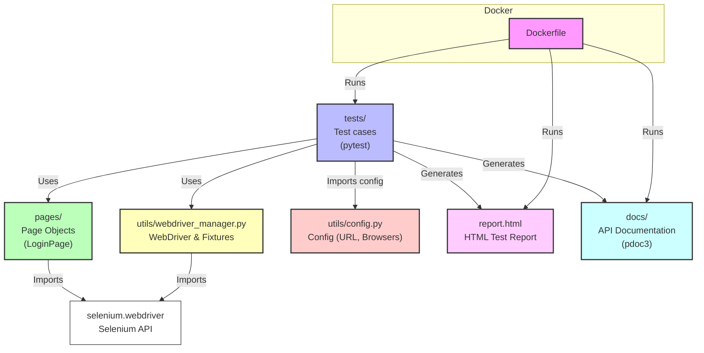

# Hudl Login Automation

## Quick Setup (One Command)

To set up all prerequisites and check your environment, simply run:

```bash
bash setup.sh
```

This script will:
- Check for Python 3 and pip
- Install all Python dependencies from requirements.txt
- Check for Java (JRE) and attempt to auto-install it if missing
- Check for the Allure commandline and attempt to auto-install it if missing
- Auto-install Homebrew (macOS) or Scoop (Windows) if needed for dependency installation
- Provide clear output and fallback/manual instructions if automation is not possible
- Ensure your environment is ready for running tests and generating reports

**We recommend all users run this script before using the project for the first time or after cloning/updating the repository.**

This project contains automated tests for the Hudl login functionality using Python, Selenium, and Pytest.

## Features
- Page Object Model (POM)
- Valid and invalid login tests
- Pytest fixtures for driver management
- Dockerized test execution
- Parallel test execution across browsers
- Automatic rerun of failed tests

## Setup

### Locally
```bash
python3 -m venv venv
source venv/bin/activate
pip install -r requirements.txt
pytest
```

### Using Docker
```bash
docker build -t hudl-tests .
docker run --rm hudl-tests
```

## Folder Structure
```
.
├── .gitignore
├── Dockerfile
├── pages/
│   └── login_page.py
├── pytest.ini
├── README.md
├── requirements.txt
├── tests/
│   └── test_login.py
├── utils/
│   ├── config.py
│   └── webdriver_manager.py
```

## Running Tests in Parallel and Across Browsers

This project supports running tests in parallel and across multiple browsers using `pytest-xdist` and a browser selection fixture.

### Supported Browsers
- chrome
- firefox
- edge

You can configure the list of supported browsers in `utils/config.py`.

### 1. Run Tests in Parallel on a Single Browser
To run tests in parallel (e.g., 4 workers) on a single browser (e.g., Chrome):

```bash
pytest -n 4 --browser=chrome
```
- `-n 4` runs 4 tests in parallel.
- `--browser=chrome` selects the browser (use `firefox` or `edge` as needed).

### 2. Run Tests in Parallel Across All Browsers

#### A. Manual Loop (Simple Approach)
Run all tests in parallel for each browser, one after another:

```bash
for browser in chrome firefox edge; do
  pytest -n 4 --browser=$browser
done
```

#### B. True Cross-Browser Parallelism (Advanced)
To run each test on all browsers in parallel, parametrize the driver fixture in `tests/conftest.py`:

```python
import pytest
from utils.config import SUPPORTED_BROWSERS
from utils.webdriver_manager import get_webdriver

@pytest.fixture(params=SUPPORTED_BROWSERS)
def driver(request):
    driver = get_webdriver(request.param)
    yield driver
    driver.quit()
```

Now, simply run:
```bash
pytest -n 4
```
Each test will run in parallel on all supported browsers.

### 3. Running in Docker
The same commands work inside Docker, as long as the necessary browser drivers are installed in the image.

### 4. Automatic Rerun of Failed Tests
This project uses `pytest-rerunfailures` and a `pytest.ini` config to automatically rerun failed tests up to 2 times with a 1-second delay:

```
[pytest]
addopts = --reruns 2 --reruns-delay 1
```

No extra configuration is needed—this applies to all test runs, locally and in Docker.

---

If you need more advanced parallelization or browser grid support, consider using Selenium Grid or cloud services like BrowserStack or Sauce Labs.

## Generating Test Reports (HTML)

This project supports generating HTML reports for your test runs using `pytest-html`.

### Run Locally with HTML Report
To run tests and generate an HTML report:

```bash
pytest --html=report.html --self-contained-html
```
- The report will be saved as `report.html` in your project directory.
- Open `report.html` in your browser to view the results.

### Run in Docker with HTML Report
To generate and access the report when running in Docker:

1. **Run the container and mount a local directory for the report:**
   ```bash
   docker run --rm -v $(pwd):/workspace hudl-tests pytest --html=/workspace/report.html --self-contained-html
   ```
   - This mounts your current directory into the container and writes the report to your local machine.

2. **Open `report.html` on your host machine after the run.**

## Generating Automatic Documentation

This project uses [pdoc3](https://pdoc3.github.io/pdoc/) to generate API documentation from Python docstrings.

### Generate Documentation Locally
To generate HTML documentation for the codebase:

```bash
pdoc --html pages utils tests --output-dir docs
```
- The documentation will be generated in the `docs/` directory.
- Open the generated HTML files in your browser to view the documentation.

### Generate Documentation in Docker
To generate documentation inside Docker and copy it to your host:

```bash
docker run --rm -v $(pwd):/workspace hudl-tests pdoc --html pages utils tests --output-dir /workspace/docs
```
- The `docs/` directory will appear in your project root on your host machine.

### Notes
- Ensure all classes and methods are well-commented with docstrings for best results.
- You can customize the output directory or modules as needed.

## Framework Architecture Diagram

Below is an overview of the project architecture and how the main components interact:



### Explanation
- **tests/**: Contains all test cases, which use page objects and utilities.
- **pages/**: Contains Page Object Model classes (e.g., `LoginPage`) for UI abstraction.
- **utils/webdriver_manager.py**: Provides WebDriver management and pytest fixtures for browser setup.
- **utils/config.py**: Central configuration for URLs and supported browsers.
- **selenium.webdriver**: The Selenium API used by both page objects and WebDriver manager.
- **report.html**: HTML test report generated by pytest-html.
- **docs/**: Auto-generated API documentation from code comments using pdoc3.
- **Dockerfile**: Enables running tests, generating reports, and documentation in a containerized environment.

## Generating Allure Reports

This project supports generating Allure reports for advanced, interactive test reporting.

### Prerequisites for Allure Reporting

1. **Python Dependencies**
   - Ensure you have installed all Python dependencies:
     ```bash
     pip install -r requirements.txt
     ```
   - This includes `allure-pytest` for Allure integration with pytest.

2. **Allure Commandline Tool**
   - The Allure commandline tool is required to generate and view reports. It is **not** a Python package and must be installed separately.
   - See platform-specific installation steps below.

3. **Java Runtime**
   - Allure requires Java (JRE) to be installed and available in your system PATH. You can check with:
     ```bash
     java -version
     ```
   - If not installed, download from [Adoptium](https://adoptium.net/) or use your OS package manager.

### 1. Install Allure Commandline (All Platforms)
You need the Allure commandline tool to view reports. Install it as follows:

#### macOS (Homebrew)
```bash
brew install allure
```

#### Windows (Scoop or Manual)
- With [Scoop](https://scoop.sh/):
  ```powershell
  scoop install allure
  ```
- Or download and unzip from the [Allure releases page](https://github.com/allure-framework/allure2/releases), then add the `bin` folder to your PATH.

#### Linux (Manual)
- Download and unzip from the [Allure releases page](https://github.com/allure-framework/allure2/releases):
  ```bash
  wget https://github.com/allure-framework/allure2/releases/download/2.27.0/allure-2.27.0.tgz
  tar -zxvf allure-2.27.0.tgz
  sudo mv allure-2.27.0 /opt/
  sudo ln -s /opt/allure-2.27.0/bin/allure /usr/bin/allure
  ```
- Or use your package manager if available.

For more details, see the [official Allure installation guide](https://docs.qameta.io/allure/#_installing_a_commandline).

### 2. Run Tests and Generate Allure Results
To run tests and generate Allure result files:

```bash
pytest --alluredir=allure-results
```

### 3. Generate and View the Allure Report
After running tests, generate and open the report:

```bash
allure serve allure-results
```
- This will start a local server and open the interactive report in your browser.

### 4. Using Allure in Docker
To generate Allure results in Docker and view them on your host:

```bash
docker run --rm -v $(pwd):/workspace hudl-tests pytest --alluredir=/workspace/allure-results
```
Then, on your host machine (with Allure installed):
```bash
allure serve allure-results
```

### Notes
- The `allure-results` directory will contain the raw results after test execution.
- You can also generate static HTML with `allure generate allure-results -o allure-report` and open the HTML files manually.
- For more options, see the [Allure documentation](https://docs.qameta.io/allure/).

## Credits

- Developed and assisted using the [Cursor](https://www.cursor.so/) platform for AI-powered coding.
- Project editing and management with [IntelliJ IDEA](https://www.jetbrains.com/idea/).
